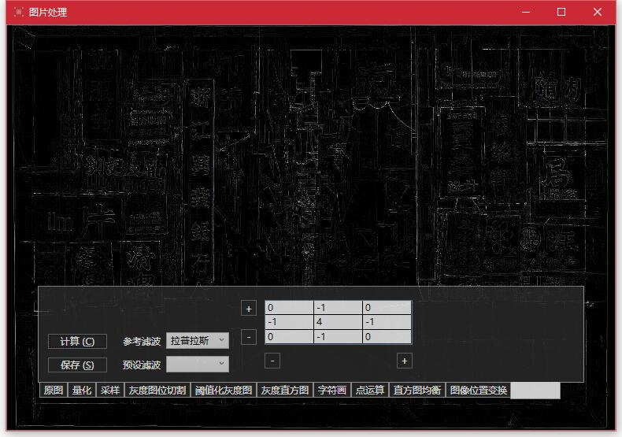

# 数字图像处理小DEMO

## 简介

 - **IDE**：Visual Studio 2015
 - **语言**：WPF & C++
 - **依赖**：
    - .NET Framework 4.5
    - Visual C++ Redistributable for Visual Studio 2015
 - **简介**：图像的各种处理操作
    - 量化
    - 采样
    - 对 8bit 灰度图每个位进行二值化
    - 8bit 灰度图的阈值化
    - 处理结果的灰度直方图
    - 处理结果转换为字符画
    - 三种点处理
    - 不那么科学的 RGB 直方图均衡化
    - 图像的平移、缩放、旋转变换
    - 支持自定义模板的频域滤波
    - 哈夫曼编码和解码

## 详细介绍

（这里的说明暂时是以前的版本。源程序已经更新，界面、功能有些变化）

### 打开一张图片

使用**打开**按钮(`Alt + O`)弹出对话框，或者直接将一张图片拖入程序中，打开这张图片。

### 保存当前显示的图片

使用**保存**按钮(`Alt + S`)弹出对话框，以保存当前显示的这张图片。

### 量化处理

切换选项卡到**量化**。

对原图像进行处理。

可以拖动滑动条选择不同的量化级别。（如图是量化级别 4，对 BGR 三通道处理的结果）

### 采样处理

切换到**采样**选项卡。

对原图像进行处理。

拖动滑动条选择不同的处理级别。

### 灰度图的位切割

切换到**灰度图的位切割**选项卡。

会将图像转化为 8bit 灰度图。

一共有九个选择，0 为原始图像的 8bit 灰度图， 1~8 代表提取的第几位。

### 灰度图的阈值化

切换到**灰度图的阈值化**选项卡。

会将图像转化为 8bit 灰度图。

拖动滑动条 `max`、`min` 以选择一个阈值化区间，区间中的灰度会变化为白色，其它部分变为黑色

### 灰度直方图

切换到**灰度直方图**选项卡。

会直接显示**当前图像**的灰度直方图以及相关信息。

可以从其它选项卡直接切换到这里，以显示其直方图。

### 转化为字符画

切换到**字符画**选项卡。

会对原图像进行处理。

可以看到两个按钮：

 - 保存为文本，可以将结果保存到一个文本文件
 - 使用文本编辑器预览，则打开一个编辑器（在关闭编辑器之前，程序将处于阻塞状态）
 - **PS**. 预览时推荐将字体大小改为 1

### 点运算

切换到**点运算**选项卡。

会将图像转化为 8bit 灰度图。

支持三种点运算操作： 线性灰度拉伸、伽马变换、对数变换

**PS**. 直接点击生成或者输入数据不合法，会使用默认的数据替代进行计算。

### 直方图均衡

切换到**直方图均衡**选项卡。

会直接对原始图像进行直方图均衡的计算。

### 图像的位置变换

切换到**图像位置变换**选项卡。

会直接对原始图像进行位置变换的计算。

有两个选项，切换**邻近插值**或者**双线性插值**进行计算。

使用**鼠标左键拖动**进行平移，**鼠标右键拖动**进行旋转和缩放。

**邻近插值**的放大效果：

**双线性插值**的放大效果：

### 频域滤波

切换到**频域滤波**选项卡。

操作将直接对原始图像进行。

**操作**：

 - 选择**参考滤波**：将使用其对应模板替换数据表格。（如果图片较大，则需要按下**计算**(`Alt + C`)按钮，才会进行计算）
 - 选择**预设滤波**：将会使用内置的计算方法**直接**计算，这些操作已经写入内部。
 - 直接编辑数据表格：会将图像与对应模板执行卷积操作。（如果图片较大，则需要按下**计算**(`Alt + C`)按钮，才会进行计算）

使用数据表格旁边的 **+**、**-** 按钮拓展或者缩小矩阵。

## 其它细节

### 个人感悟

 - 第一次：
    - 学习使用 C 风格的 M$ 动态链接库
    - 学习使用 WPF 制作界面
    - 尝试 WPF & C++ 编程
 - 死磕各种细节（详见 DONE）

### TODO

 - 使用多线程或者异步，实现 用户界面 和 运算逻辑 的分离
 - 完整的“关于”窗口
 - C# 代码过于混乱，需要整理
 - 运行效率较低，可以优化
 - 第二次美化界面

### DONE

 - 打开图片时，（非全屏模式下）窗口自动适应图片
 - 拖拽图片文件以打开图片
 - 按住 Alt 显示快捷键的下划线
 - 如果图像较小（默认为 1024000 像素以下），将会实时计算（例如更改参数时便会立即计算）
 - 非实时运算下，只有在松开 Slider 滑块时，才处理图片
 - 支持打开、保存为多种类型的图片，不支持的文件将会有消息窗口提示
 - 程序、dll 文件的附加信息（右键，属性可以看到）
 - 简单的“关于”窗口
 - 在程序中调用文本编辑器打开字符画
 - 第一次美化界面
 - 灰白格子的图片背景
 - 限定数值类型以及大小的 Textbox 输入框
 - 使用鼠标拖拽完成图像的平移、缩放、旋转变换
 - 可以高度自定义的频域滤波模板的输入
