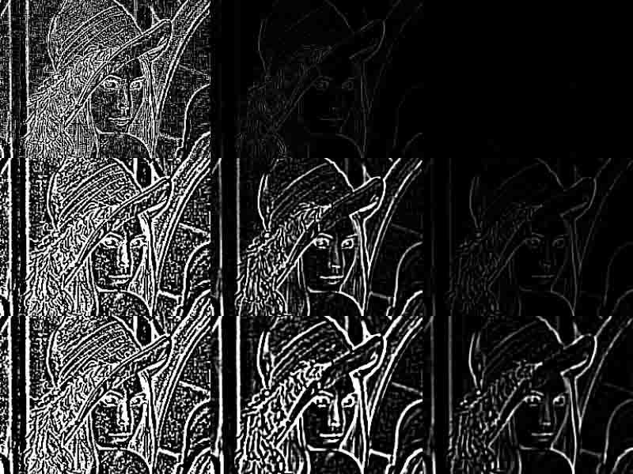

# 简介

学习并实现 LoG（Laplacian of Gaussian）算子，用它对图片进行处理。

# 内容

1. LoG 算子简介
2. 实现并使用 LoG 对图片进行卷积

# 过程

## LoG 算子简介

拉普拉斯（Laplace）算子：常用于高通滤波，例如图像锐化、边缘检测。

$$
\nabla^2f=\frac{\partial^2f}{\partial{x^2}}+\frac{\partial^2f}{\partial{y^2}}
$$

高斯（Gauss）滤波：常用于平滑化滤波，例如降低图像的噪声。

$$
G(x,y,\sigma)=\frac{1}{2\pi\sigma^2}e^{-(x^2+y^2)/2\sigma^2}
$$

拉普拉斯（Laplace）算子对图像进行边缘检测，为了**降低它对噪声的敏感性**，可以将它与平滑过程一起利用零交叉进行边缘检测。

即：对二维高斯函数应用拉普拉斯算子：

$$
\nabla^2G=\frac{\partial^2G}{\partial{x^2}}+\frac{\partial^2G}{\partial{y^2}}=
\frac{-2\sigma^2+x^2+y^2}{2\pi\sigma^6}e^{-(x^2+y^2)/2\sigma^2}
$$

这里定义 LoG 为：

$$
LoG=\sigma^2\nabla^2G=-\frac{1}{\pi\sigma^4}[1-\frac{x^2+y^2}{2\sigma^2}]e^{\frac{-(x^2+y^2)}{2\sigma^2}}
$$

资料参考：

- 课件
- [计算机视觉—DoG和LoG算子](http://blog.csdn.net/gnehcuoz/article/details/52793654)
- [Laplacian/Laplacian of Gaussian](http://homepages.inf.ed.ac.uk/rbf/HIPR2/log.htm)

## 实现并使用 LoG 对图片进行卷积

 - 语言：C++
 - 使用的库：OpenCV 3.3

根据 LoG 的定义，写出该函数：

```C++
float log(int x, int y, float sigma)
{
    float s2 = sigma * sigma;

    float c = - (x * x + y * y) / (2.f * s2);
    float b = 1 + c;
    float a = -1.f / (float(M_PI) * s2 * s2);

    return a * b * std::exp(c);
}
```

使用 LoG 函数计算出任意大小下的核心。这里计算结果减去了矩阵均值，使得核的值总和为 0。参考代码：

```C++
cv::Mat log_kernal(size_t size, float sigma, float(*f)(int, int, float))
{
    auto siz = static_cast<int>(size | 1);
    auto beg =   - (siz >> 1);
    auto end = 1 + (siz >> 1);
    auto bis = -beg * (siz + 1);

    auto vec = std::vector<float>(siz * siz);
    for (auto x = beg; x < end; x++)
        for (auto y = beg; y < end; y++)
            vec[bis + x * siz + y] = f(x, y, sigma);

    float sum = std::accumulate(vec.begin(), vec.end(), 0.f);
    float mean = sum / static_cast<float>(vec.size());
    for (auto & f : vec)
        f -= mean;

    return cv::Mat(siz, siz, CV_32F, vec.data()).clone();
}
```

卷积操作：

```C++
cv::filter2D(img, dst, CV_32F, kernal);
dst.convertTo(dst, CV_8U, 255);
```

剩余部分为打开图片等相关操作略去。

运行程序，并打开经典的 lena 图，尝试不同的核大小和 sigma 的值：

| size = 3, sigma = 1.0 | size = 3, sigma = 2.0 | size = 3, sigma = 3.0 |
| --------------------- | --------------------- | --------------------- |
| size = 5, sigma = 1.0 | size = 5, sigma = 2.0 | size = 5, sigma = 3.0 |
| size = 7, sigma = 1.0 | size = 7, sigma = 2.0 | size = 7, sigma = 3.0 |

得到了这些图片：



我们能够注意到，在没有阈值化处理下，图像随着：

- 核增加，边缘线条减少，图像变暗
- sigma 增加，噪声减少，边缘线条变粗，图像变模糊

