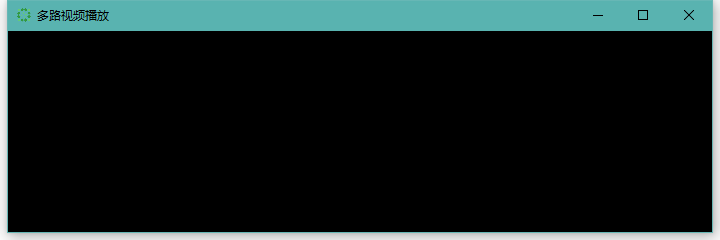
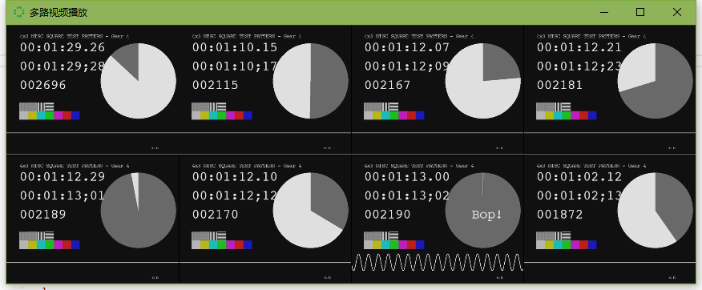

# 简介

制作一个支持同时显示 8 个直播的视频流的**播放端**软件。

# 内容

1. 技术方案的选择
2. 编写图形用户界面
3. 对程序进行简单的测试

# 过程

## 技术方案的选择

经过简单的查阅资料，我了解到这些主要信息：

- [主要的直播系统](https://en.wikipedia.org/wiki/Comparison_of_streaming_media_systems)。

- 主要的直播流协议有：

  | 协议       | 全称                        | 基于   | 特点          |
  | -------- | ---------------------------- | ---- | ----------------- |
  | RTMP     | Real Time Messaging Protocol | TCP  | 延迟 1S～3S，依赖 Flash |
  | RTSP     | Real Time Streaming Protocol | UDP  | 延迟 1S～3S          |
  | HLS      | HTTP Live Streaming          | HTTP | 延迟 >10S，性能较好   |
  | HTTP-FLV | RTMP over HTTP               | HTTP | 延迟1S～3S           |

- 在 Windows 下主要的图形界面库有：

  - WPF (C#)
  - QT (C++)

- 常见的视频[编码解码器](https://en.wikipedia.org/wiki/Comparison_of_video_codecs)：

  - x264
  - x265
  - libvpx
  - FFmpeg

由于注意到 [WPF 的 MediaElement 支持 HLS 协议](http://www.c-sharpcorner.com/UploadFile/5c2d70/windows-10-stream-live-through-media-element-http-hls-st/)，因此这里选择使用它编写图形界面。

## 编写图形用户界面

在 Visual Studio 2017 中，新建一个 WPF 应用。

在窗口 [`MainWindow.xaml`](multiplay/MainWindow.xaml) 中：

- 为 `Window` 设定 `AllowDrop="True"`，并添加一个 `Drop` 事件。
- 添加一个 `UniformGrid` 作为多个视频控件的容器。

```xml
<Window x:Class="multiplay.MainWindow"
        xmlns="http://schemas.microsoft.com/winfx/2006/xaml/presentation"
        xmlns:x="http://schemas.microsoft.com/winfx/2006/xaml"
        xmlns:d="http://schemas.microsoft.com/expression/blend/2008"
        xmlns:mc="http://schemas.openxmlformats.org/markup-compatibility/2006"
        xmlns:local="clr-namespace:multiplay"
        mc:Ignorable="d"
        Title="多路视频播放" Height="240" Width="720"
        AllowDrop="True" Drop="OnDrop">
    <UniformGrid x:Name="mediaGrid" Background="Black">
    </UniformGrid>
</Window>
```

在此我们可以看到一个空的程序界面：


接着需要在 [`MainWindow.xaml.cs`](multiplay/MainWindow.xaml.cs) 中：

- 初始化视频播放控件 `MediaElement`。
- 实现拖拽事件 `OnDrop`。
- 实现从 [`urls.xml`](multiplay/urls.xml) 文件读取 HLS 链接。

这个步骤完成之后，就可以看到一个支持本地文件、HLS 协议的流的程序了：



## 对程序进行简单的测试

## 本地文件

这里找了一些公开课的视频文件进行测试：


可以观察到的是，CPU、GPU、硬盘占用均持续较高。选择并使用更加优秀的视频编码解码器可能可以改善这个情况。

## HLS 流

这里使用了一个 HLS 测试链接：`http://playertest.longtailvideo.com/adaptive/bipbop/gear4/prog_index.m3u8`进行测试。

将此链接写入 [`urls.xml`](../src/module/multiplay/urls.xml) 文件，并运行程序。可以看到如下结果：



在测试中能够发现，下载速度保持在 1MB/s 的状态。同时，受到不稳定的网络影响，该播放经常出现断开、卡顿等情况。

# 使用 FFmpeg 替换默认编码解码器

在权衡并测试使用 ：

- [Meta Vlc](https://github.com/higankanshi/Meta.Vlc)
- [LibVLC.NET](https://libvlcnet.codeplex.com/)
- [WPF-MediaKit](https://github.com/Sascha-L/WPF-MediaKit)
- [FFME](https://github.com/unosquare/ffmediaelement)

最终选择了 [FFME](https://github.com/unosquare/ffmediaelement) 提供的方案进行尝试。主要是因为 FFME 能够非常容易替换 MediaElement。

按照 [FFME](https://github.com/unosquare/ffmediaelement) 提供的参考步骤，即可编译运行：

- [Compiling, Running and Testing](https://github.com/unosquare/ffmediaelement#compiling-running-and-testing)
- [Using FFME in your Project](https://github.com/unosquare/ffmediaelement#compiling-running-and-testing)

需要注意的是，在个人尝试的过程中，当前版本 [2.0.b1](https://github.com/unosquare/ffmediaelement/releases/tag/v2.0.0-b1)，没有看到提到的：

> You can use the resulting compiled assembly in your project without further dependencies as FFME is entirely self-contained. The locations of the compiled FFME assembly, depending on your build configuration are either `...\ffmediaelement\Unosquare.FFME\bin\Debug\Unosquare.FFME.dll` or `...\ffmediaelement\Unosquare.FFME\bin\Release\Unosquare.FFME.dll`

最终自己单独提取了：

- `ffme.dll`
- `FFmpeg.AutoGen.dll`
- `ffmpeg/*`（来自 `ffmpeg-3.4-win32-shared/bin/*`）

并在窗口初始化时：

- `MediaElement.FFmpegDirectory = @".\ffmpeg\";`

才成功使得程序运行：

同时也能观察到，程序 CPU 使用率保持在 60%。但是 GPU 却在 10% 以内。可以推测此库使用的 FFmpeg 并没有使用独立显卡解码。

相比之下 [WPF-MediaKit](https://github.com/Sascha-L/WPF-MediaKit) 可以调用 K-Lite Codec Pack 的解码器，性能更好。但是我在测试时发现当前版本无法获取视频的原始大小 `NaturalVideoHeight` 等，有待完善。
