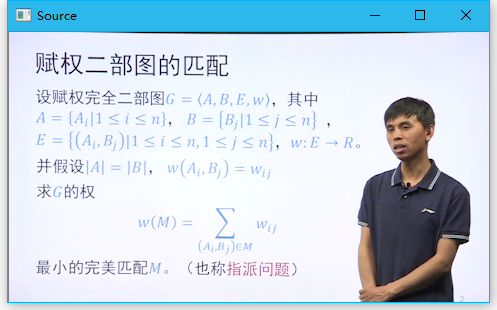
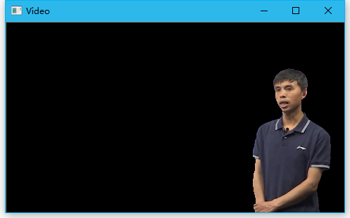

# 简介

视频图像分割。在计算机视觉领域，图像分割（Segmentation）指的是将数字图像细分为多个图像子区域（像素的集合）（也被称作超像素）的过程。图像分割的目的是简化或改变图像的表示形式，使得图像更容易理解和分析。

参考：

- [Image segmentation](https://en.wikipedia.org/wiki/Image_segmentation)

# 内容

1. 了解常用的图像分割方案和知识。
2. 自选视频并编写程序进行视频的图像分割。
3. 分析和总结实验过程。

# 过程

经过简单的搜集资料，可以了解到一般的图像分割方案：

- 聚类法
- 直方图法
- 边缘检测
- 区域生长
- 基于深度学习的方法

在本次作业中，我们需要对自选视频中的人物进行分割。目标是去掉视频中的背景，提取人物。虽然目前了解到利用深度学习能够较为容易实现需求，但考虑是基于OpenCV的实现，暂时不使用这个方案。后期的学习中会使用深度学习来做这个工作。

因此决定使用更加传统的方案。

首先考虑使用 OpenCV 中的行人检测以及 GrabCut 实现目标的提取。其基本思路是，选取一个行人视频，提取视频中的行人并标记，将其作为 GrabCut 的素材进行前景分离。但是在实际使用过程中，效果并不好。一方面是在视频素质欠佳的状态，OpenCV 的经典级联分类器 `CascadeClassifier` 配合默认的模型 `haarcascade_fullbody.xml` 对行人的姿态要求较高，无法稳定地识别行人。另一方面是 GrabCut 处理速度较慢，且在视频中难以提供背景的种子点，在复杂的视频中效果很差。

也考虑过常规的基于边缘检测的方案。但是使用 `Gaussian` + `Laplacian` 或者 `Canny` 得到的边缘，在复杂背景下往往不连续，即使加大边缘检测算子或者通过膨胀处理，目标边缘仍然经常无法闭合。且划分出的边缘很多，难以确定哪些边缘属于目标物体。

最终，选择使用一个较为简单的公开课素材来处理。前、后景分明，大大降低了分割难度。视频截图：



针对目标视频人物、背景分明，人物站位标准的特点，使用了这样一个过程来做视频的图像分割：

1. 提取视频的每一帧；
2. 检测人脸的位置并标记；
3. 对帧进行高斯（减少噪点）、阈值化（分离人物和背景）、膨胀腐蚀（进一步消去二值图中的噪点）；
4. 根据人脸的标记，查找并筛选出包含标记的连通域；
5. 以连通域作为 mask，绘制图像。

开发环境：

 - 语言：C++
 - 使用的库：OpenCV 3.3

主要代码（完整参考 [main.cpp](is/main.cpp)）：

```c++
// 查询人脸的中心位置
std::vector<cv::Point> points;
{
  std::vector<cv::Rect> rects;
  classifier.detectMultiScale(src, rects);
  points.reserve(rects.size());
  for (auto & rect : rects) {
    points.emplace_back((rect.br() + rect.tl()) / 2);                
  }
}

// 转换图像类型，方便进行二值化
src.convertTo(dst, CV_8UC3);
cv::cvtColor(dst, dst, cv::COLOR_BGR2GRAY);

// 减少噪声并二值化
cv::GaussianBlur(dst, dst, cv::Size(3, 3), 0.0);
cv::threshold(dst, dst, 192.0, 255.0, cv::THRESH_BINARY_INV);

// 膨胀和腐蚀，进一步消除噪点
cv::dilate(dst, dst, cv::getStructuringElement(cv::MORPH_RECT, cv::Size(3, 3)));
cv::erode(dst, dst, cv::getStructuringElement(cv::MORPH_RECT, cv::Size(5, 5)));

// 删除不符合要求的连通域
{
  std::vector<std::vector<cv::Point> > contours;
  std::vector<std::vector<cv::Point> > refs;
  cv::findContours(dst, contours, cv::RETR_EXTERNAL, cv::CHAIN_APPROX_SIMPLE);
  for (auto & contour : contours) {
    auto it = std::find_if(points.begin(), points.end(), [&](auto & it) {
      return cv::pointPolygonTest(contour, it, false) > 0.0;
    });
    if (it != points.end())
      refs.emplace_back(std::ref(contour));
  }

  cv::Mat msk = cv::Mat::zeros(dst.size(), CV_8U);
  cv::drawContours(msk, refs, -1, cv::Scalar::all(255), cv::FILLED);
  src.copyTo(dst, msk);
}

cv::imshow("Video", dst);
```

运行这些代码，对于该测试视频，效果良好，可以得到如下结果：



这种方案仍然存在很多问题，只使用于此类前后景区分明显，人物姿态较为标准的场景，无法应对复杂场景。日后考虑采用深度学习的方案对其进行进一步改进。